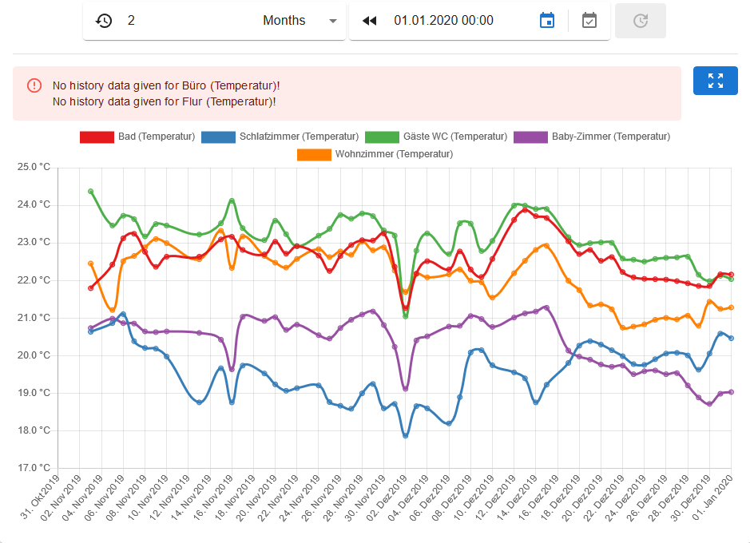
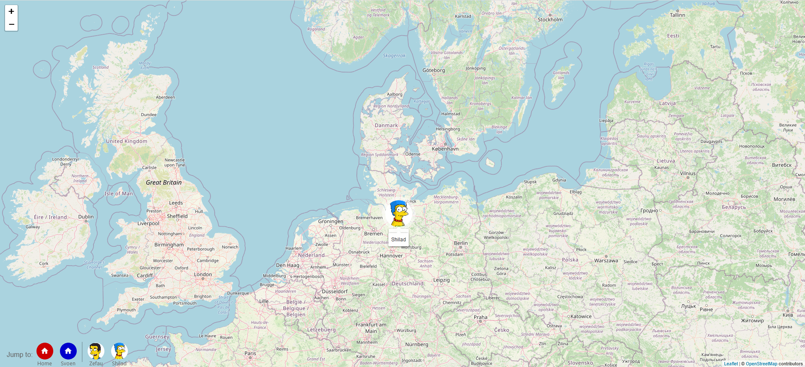
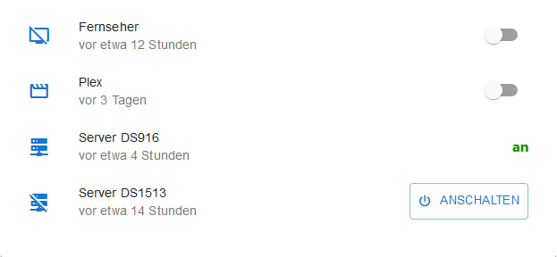
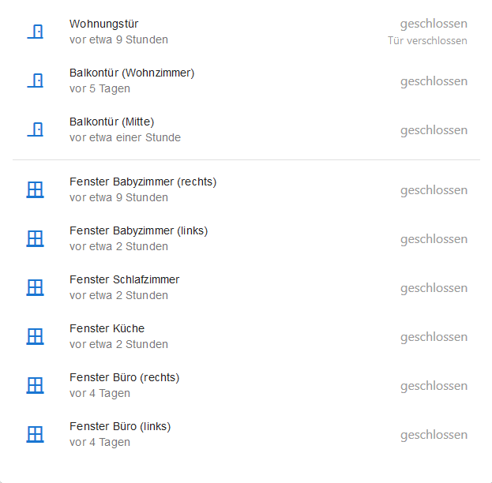
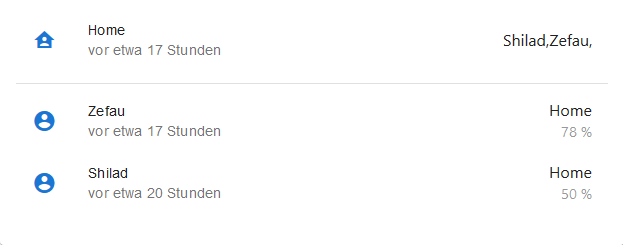
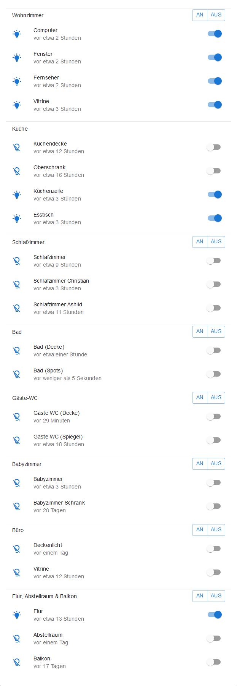

## Einführung

Module dienen der Visualierung von Datenpunkten und Informationen.

## Globale Einstellungen für Module

Jedes Modul, dass in einem Widget (einer Box) angezeigt wird (und damit nicht fullscreen ist), unterstützt die folgenden Einstellungen:
| Parameter | Beschreibung | mögliche Werte | Standard |
| - | - | - | - |
| `title` | individueller Titel der Box | beliebiger Wert |  |
| `icon` | individuelles Icon der Box | beliebiges Icon von https://materialdesignicons.com/ | `home` |
| `iconStyle` | individueller Style des Icons der Box | *[CSS-Anweisungen](https://www.w3schools.com/cssref/default.asp) in Javascript Syntax* | `{ backgroundColor: theme.palette.primary.main, color: '#fff', fontSize: '24px' }` |

## Liste der Module
- [AdapterStatus](#modul-adapterstatus)
- [Calendar](#modul-calendar)
- [Chart](#modul-chart)
- [CustomHTML](#modul-customhtml)
- [DateTime](#modul-datetime)
- [DisplayImage](#modul-displayimage)
- [iFrame](#modul-iframe)
- [Map](#modul-map)
- [MediaControl](#modul-mediacontrol)
- [StateList](#modul-statelist)
- [StateListHorizontal](#modul-statelisthorizontal)
- [Weather](#modul-weather)

### Modul: AdapterStatus
#### Kurzbeschreibung
Zeigt alle installierten Adapter mit ihren Instanzen und dem jeweiligen Status (active & alive, active & not connected, inactive) an.

#### Beispiel Screenshots
##### Screenshot1
<kbd></kbd>

#### Konfiguration
| Parameter | Beschreibung | Typ | Standard |
| - | - | - | - |
| `updates` | Adapter Updates  | Switch | `true` |
| `list` | Liste angezeigter Adapter  | Text | - |
| `blacklist` | Liste nicht angezeigter Adapter  | Text | - |

***

### Modul: Calendar
#### Kurzbeschreibung
Zeigt ical / ics Inhalte in einem Kalender an.

#### Beispiel Screenshots

#### Konfiguration
| Parameter | Beschreibung | Typ | Standard |
| - | - | - | - |

| `calendarPreview` | Zeigt eine Kalender-Vorschau  | Switch | `true` |
| `calendarView` | Wähle die Art der Anzeige von Ereignissen  | RadioGroup | `listView` |
| `refresh` | Aktualisierung (in Minuten)  | Number | `5` |
| `daysReview` | Zeigt vergangene Ereignisse (in Tagen)  | Number | - |
| `daysPreview` | Zeigt zukünftige Ereignisse (in Tagen)  | Number | `7` |

***

### Modul: Chart
#### Kurzbeschreibung
Stellt historische Werte (z.B. aus ioBroker.history) grafisch als Chart mittels Chart.js dar.

#### Beispiel Screenshots
##### Screenshot1
<kbd></kbd>

#### Konfiguration
| Parameter | Beschreibung | Typ | Standard |
| - | - | - | - |
| `chartConfigyLeftAxisUnitBefore` | Einheit der y-Achse (vor dem Bezeichner)  | Text | - |
| `chartConfigyLeftAxisUnitAfter` | Einheit der y-Achse (nach dem Bezeichner)  | Text | - |
| `chartFilterTimeRangeValue` | Standard-Zeit des historischen Rückblicks  | Number | `1` |
| `chartFilterTimeRangeUnit` | Standard-Einheit des historischen Rückblicks  | Select (`seconds`, `minutes`, `hours`, `days`, `weeks`, `months`, `years`) | `days` |
| `liveUpdates` | Live-Aktualisierung  | Switch | `true` |
| `multiplicator` | Multiplikator  | Number | `1` |

***

### Modul: CustomHTML
#### Kurzbeschreibung
Zeigt dynamische HTML Inhalte von Datenpunkten an.

#### Beispiel Screenshots

#### Konfiguration
Keine Konfiguration

***

### Modul: DateTime
#### Kurzbeschreibung
Das Modul dient der Anzeige des aktuellen Datums und Zeit.

#### Beispiel Screenshots
##### Screenshot1
<kbd></kbd>

#### Konfiguration
| Parameter | Beschreibung | Typ | Standard |
| - | - | - | - |
| `format` | Format des Datums / Uhrzeit  | Text | `d. MMMM yyyy HH:mm` |
| `style` | Style des Textes  | Text | `{ "fontSize": "1.5rem", "textAlign": "center" }` |
| `city` | Zeigt die Stadt  | Switch | `true` |
| `sun` | Zeigt Zeiten für Sonnenauf- und -untergang  | Switch | `true` |
| `calendarweek` | Zeigt die aktuelle Kalenderwoche  | Switch | `true` |

***

### Modul: DisplayImage
#### Kurzbeschreibung
Zeigt ein Bild aus einer URL oder einem base64-Wert an.

#### Beispiel Screenshots

#### Konfiguration
| Parameter | Beschreibung | Typ | Standard |
| - | - | - | - |
| ***`url`*** | Datenpunkt, URL oder Base64-Wert des Bilds  | Text | `http://` |
| `height` | Höhe des Fensters  | Text | `100%` |
| `width` | Breite des Fensters  | Text | `100%` |
| `refresh` | Aktualisierungsintervall  | Number | `0` |

***

### Modul: iFrame
#### Kurzbeschreibung
Zeigt Inhalte anderer Seiten in einem iFrame an.

#### Beispiel Screenshots

#### Konfiguration
| Parameter | Beschreibung | Typ | Standard |
| - | - | - | - |
| ***`url`*** | URL, die zu laden / anzuzeigen ist  | Text | `http://` |
| `height` | Höhe des iFrame Fensters  | Text | `100%` |
| `width` | Breite des iFrame Fensters  | Text | `100%` |
| `refresh` | Aktualisierungsintervall  | Number | `0` |

***

### Modul: Map
#### Kurzbeschreibung
Zeigt eine Karte von OpenStreetMap.

#### Beispiel Screenshots
##### Screenshot1
<kbd></kbd>

#### Konfiguration
| Parameter | Beschreibung | Typ | Standard |
| - | - | - | - |
| `defaultZoom` | initialer Zoom der Karte  | Number | `10` |
| `defaultPosition` | initiale Koordinaten auf der Karte  | Text | - |
| `tooltipDirection` | Richtung in die der Tooltip öffnet  | Select (`auto`, `center`, `top`, `left`, `right`, `bottom`) | `bottom` |
| `tooltipPermanent` | Permanenter Tooltip  | Switch | `true` |
| `height` | Höhe der Karte  | Number | `500` |

***

### Modul: MediaControl
#### Kurzbeschreibung
Zeigt ein Multimedia-Player an (z. B. Spotify).

#### Beispiel Screenshots

#### Konfiguration
| Parameter | Beschreibung | Typ | Standard |
| - | - | - | - |
| ***`adapter`*** | Musik Adapter  | Select | - |
| `coverMode` | Cover Modus  | Switch | - |
| `coverHeight` | Cover Höhe  | Number | `200` |
| `coverUrl` | Cover Prefix URL  | Text | - |

***

### Modul: StateList
#### Kurzbeschreibung
Zeigt eine Liste von States an.

#### Beispiel Screenshots
##### Screenshot1
<kbd></kbd>

##### Screenshot2
<kbd></kbd>

##### Screenshot3
<kbd></kbd>

##### Screenshot4
<kbd></kbd>

#### Konfiguration
Keine Konfiguration

***

### Modul: StateListHorizontal
#### Kurzbeschreibung
Zeigt eine Liste von States (horizontal) an.

#### Beispiel Screenshots
##### Screenshot1
<kbd></kbd>

#### Konfiguration
Keine Konfiguration

***

### Modul: Weather
#### Kurzbeschreibung
Zeigt die Wetter-Vorschau an.

#### Beispiel Screenshots

#### Konfiguration
| Parameter | Beschreibung | Typ | Standard |
| - | - | - | - |
| ***`apikey`*** | API Schlüssel (affiliate_id) von daswetter.com  | Text | - |
| ***`localid`*** | Ort (localid) von daswetter.com  | Text | - |
| `display` | Anzeigevariante  | Select (`both`, `overview`, `preview`) | `both` |
| `forecastSunRain` | Zeige Sonne/Regen-Vorschau  | Switch | `true` |
| `iconSetWeather` | Icon Set Wetter  | Select (`set1,_translated`, `set2,_translated`, `set3,_translated`, `set4,_translated`, `set5,_translated`, `set5-white,_translated`) | `set5` |
| `forecastTemperature` | Zeige Temperatur-Vorschau  | Switch | `true` |
| `forecastWind` | Zeige Wind-Vorschau  | Switch | `true` |
| `iconSetWind` | Icon Set Wind  | Select (`set1,_translated`, `set2,_translated`, `set5-white,_translated`) | `set2` |

***

